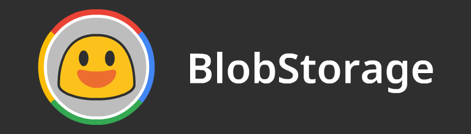

# BlobStorage

This is the repository where the source SVGs, the optimized SVGs and 128x PNGs for the Blob Color Font project are stored. 
The emoji are either based on or directly from the [Noto Color Emoji](https://github.com/googlei18n/noto-emoji/) before the Oreo update. 
All the output files were generated and can be used without having to build anything. 

## Usage
The BlobStorage is being used in the [BlobCompiler](https://github.com/blobcolorfont/BlobCompiler/) project, where it will build a SVGinOT font with all the emojis here. 
Our emojis can be used outside the font project as long as you credit us.

## Building /svg/ and /png/
To build the SVG along with the skin-colored variants, you need [Node.js](https://nodejs.org/en/) installed, the packages (svgo and sharp) are necessary to optimize and export the SVGs, which can be done by executing ``npm install``. 
After they are installed, execute ``npm run build`` and the /svg/ and /png/ folder will be built from all the folders from /src/.

## License
All the image resources released under this repository are licensed under the [Apache license, version 2.0](./LICENSE).