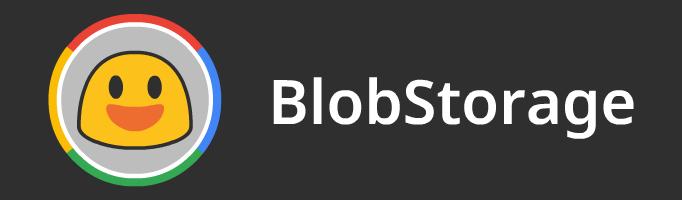

# BlobStorage

This is the repository where the source SVGs, the optimized SVGs and 128x PNGs for the Blob Color Font project are stored.

The emoji are either based on or directly from the [Noto Color Emoji](https://github.com/googlei18n/noto-emoji/) before the Oreo update.

All the output files were generated and can be used without having to build anything.

If you wish to contribute, you can make your own emoji by following the [guidelines](./GUIDELINES.md) then place it on the adequate folder in /src/, after that, build it and make a pull request.

## Usage
The BlobStorage is being used in the [BlobCompiler](https://github.com/blobcolorfont/BlobCompiler/) project, where it will build a SVGinOT font with all the emojis here.

Our emojis can be used outside the font project as long as you credit us.

## Building the /output/ folder.
To build the SVG along with the skin-colored variants, you need [Node.js](https://nodejs.org/en/) installed, some packages are necessary to be able to build the SVGs and PNGs, which can be installed by executing ``yarn install``.

After they are installed, execute ``yarn run build`` and the entire /output/ folder will be built from all the SVGs in /src/.

## License
All the image resources released under this repository are licensed under the [Apache license, version 2.0](./LICENSE).